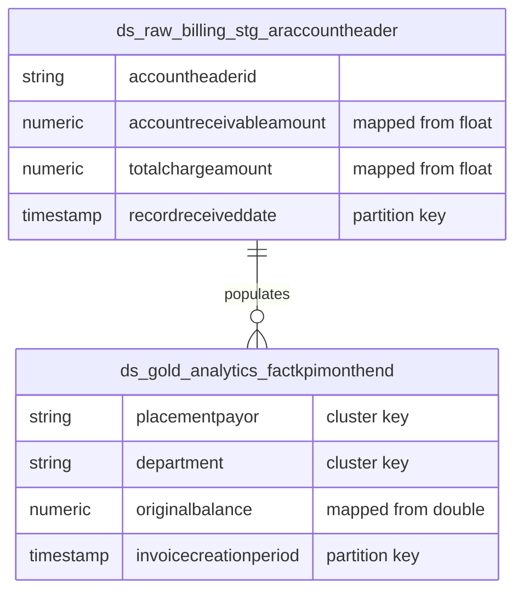

# Locked Decisions for Story 7ac12b36-c6d9-4e59-b1f0-20242d7379ad

## Implementation Approach
We will manage the BigQuery Schema DDLs as **Raw GoogleSQL Scripts**.

- **File Structure**: All 86 `CREATE TABLE` and `CREATE VIEW` statements will be authored as standalone `.sql` files placed in `/workspace/project/sql/`.
- **Dataset Targets**:
  - `ds_raw_billing` (Bronze): Raw transactional mirrors (e.g., `stg_araccountheader`).
  - `ds_gold_analytics` (Silver/Gold): Conformed facts and dimension aggregations (e.g., `factkpimonthend`).
- **Idempotency**: Scripts will use `CREATE TABLE IF NOT EXISTS` or `CREATE OR REPLACE TABLE` constructs, ensuring they can be rerun cleanly by the CI/CD pipeline or Airflow runner without failure.
- **Table Options**: All configuration (like `partition_expiration_days` or `description`) will be defined intrinsically within the `OPTIONS(...)` block of each `CREATE TABLE` script, centralizing the schema definition.

## Data Mapping
The schema will map the legacy Hive/Cloudera 86 tables strictly to BigQuery, prioritizing exact financial parity.

### 1. Data Type Mapping
All legacy `float`, `double`, and `DECIMAL` types (e.g., `accountreceivableamount`, `originalbalance`, `totalcharges`) will be explicitly cast/defined as BigQuery `NUMERIC` to guarantee exact decimal arithmetic and prevent floating-point drift in RCM aggregates.

### 2. Partitioning & Clustering Strategy
- **Time-Unit Partitioning**: Large transactional and reporting tables will use `PARTITION BY DATE(timestamp_col)` on their primary business date.
  - *Example*: `stg_araccountheader` partitioned by `DATE(recordreceiveddate)`.
  - *Example*: `factkpimonthend` partitioned by `DATE(invoicecreationperiod)`.
- **Multi-Column Clustering**: Datamart objects read directly by Tableau will apply `CLUSTER BY` on high-cardinality filters.
  - *Example*: `factkpimonthend` clustered by `(placementpayor, department, providername)`.

### Target ER Diagram (Representative sample)

### 3. Structural Field Modifications
Any legacy string fields representing IDs will remain `STRING` or be cast to `INT64` based on the native target structure requirements, avoiding legacy Hive string coercions. Legacy partition columns like `organizationgroupid` and `batch_id` will be preserved as standard columns, relying instead on BigQuery's native column partitioning over `DATE`/`TIMESTAMP` types for scan reduction.

## Validation
Validation will leverage the platform's declarative MVS testing harness to verify structural and mathematical parity against the target BigQuery environment:

1. **Schema Exists & Complete**: Assert that all 86 scripts execute with 0 failures on a scratch environment and all 86 tables/views are discoverable in the BigQuery live catalog.
2. **Numeric Enforced**: Compare every live column recursively against the legacy Hive schema, issuing a HARD FAIL if any float/double column failed to map explicitly to `NUMERIC` or `BIGNUMERIC`.
3. **Partition/Cluster Assertions**: Query the `INFORMATION_SCHEMA.COLUMNS` and `TABLES` to strictly assert that `is_partitioning_column = YES` for the designated business dates, and that the specified `clustering_columns` exist exactly as designed to support Tableau pruning.
4. **Coercion Read Test**: Run a baseline `SELECT *` or aggregate test on all 86 tables to verify zero runtime type-coercion errors during data reads.
