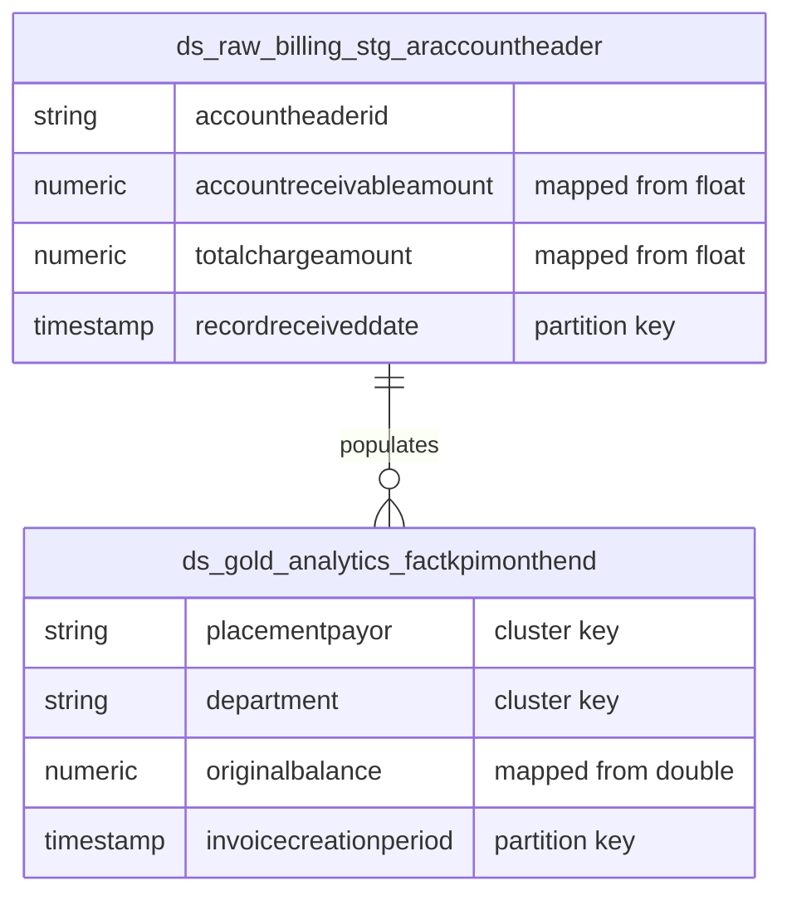

# Data Mapping

The schema will map the legacy Hive/Cloudera 86 tables strictly to BigQuery, prioritizing exact financial parity.

### 1. Data Type Mapping
All legacy `float`, `double`, and `DECIMAL` types (e.g., `accountreceivableamount`, `originalbalance`, `totalcharges`) will be explicitly cast/defined as BigQuery `NUMERIC` to guarantee exact decimal arithmetic and prevent floating-point drift in RCM aggregates.

### 2. Partitioning & Clustering Strategy
- **Time-Unit Partitioning**: Large transactional and reporting tables will use `PARTITION BY DATE(timestamp_col)` on their primary business date.
  - *Example*: `stg_araccountheader` partitioned by `DATE(recordreceiveddate)`.
  - *Example*: `factkpimonthend` partitioned by `DATE(invoicecreationperiod)`.
- **Multi-Column Clustering**: Datamart objects read directly by Tableau will apply `CLUSTER BY` on high-cardinality filters.
  - *Example*: `factkpimonthend` clustered by `(placementpayor, department, providername)`.

### Target ER Diagram (Representative sample)

### 3. Structural Field Modifications
Any legacy string fields representing IDs will remain `STRING` or be cast to `INT64` based on the native target structure requirements, avoiding legacy Hive string coercions. Legacy partition columns like `organizationgroupid` and `batch_id` will be preserved as standard columns, relying instead on BigQuery's native column partitioning over `DATE`/`TIMESTAMP` types for scan reduction.
